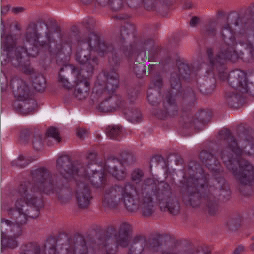
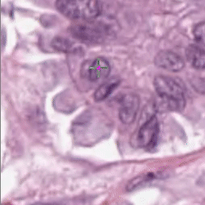

# NuClick (pytorch implementation)
Pytorch implementation of NuClick for interactive cell segmentation.





"NuClick is a CNN-based approach to speed up collecting annotations for microscopic objects requiring minimum interaction from the annotator."

For more information about netowrk architecture and training process, refer to the following papers (please consider citing these if you use NuClick in your research):

> Navid Alemi, Mostafa Jahanifar, et al. "NuClick: a deep learning framework for interactive segmentation of microscopic images." Medical Image Analysis 65 (2020): 101771.

> Jahanifar, Mostafa, Navid Alemi Koohbanani, and Nasir Rajpoot. "Nuclick: From clicks in the nuclei to nuclear boundaries." arXiv preprint arXiv:1909.03253 (2019).

## Install dependencies
First, please install PyTorch based on official guidelines [here](https://pytorch.org/get-started/locally/). Make sure if you want to use GPU computations, you have the appropriate version of Cuda Toolkit installed before installing PyTorch. After that, simply run the following command to install allt the requirements:
```bash
> pip install -r requirements.txt
```
> This repository has been tested with PyTorch 1.9 and 1.10, but should work with newer versions as well.

## Using pretrained NuClick

We release pretrained model weights for two different network architectures implemented in this repository. Both architectures use the sample principle for insteractive segmentation. You can download these weights using the following links.

- [NuClick architecture](https://drive.google.com/file/d/1JBK3vWsVC4DxbcStukwnKNZm-vCSLdOb/view?usp=sharing): The original NuClick architecture introduced in the [paper](https://arxiv.org/abs/2005.14511).
- [UNet architecture](https://drive.google.com/file/d/1d_ypVYTsXoMrTVJaEfVRGS5CfLkxyViK/view?usp=sharing): An imporoved UNet model trained for interactive segmentation.

Having the pretrained weights downloaded, you can call the `predict.py` CLI and provide it with paths to input image, point set, and expected output:

```consol
> python predict.py --model nuclick -w "checkpoints/NuClick_Nuclick_40xAll.pth" -i input_image.png -p input_points.csv -o "path/to/save/output/"
```
where the `input_points.csv` should be a list of point coordinates in `(x,y)` format (without header).


Alternatively, you can do nuclei boundary prediction on multiple images using a single command, by proving a path to directories which contain your images and point annotations:

```consol
> python predict.py --model nuclick -w "checkpoints/NuClick_Nuclick_40xAll.pth" -imgdir "path/to/images/" -pntdir "path/to/points/" -o "path/to/save/"
```
You only need to make sure that for each image in the `imgdir` exists a point set (in csv format) in the `pntdir`. 

To see all the options you have with `predict.py` function, simply run:
`python predict.py -h`

We have put an examplar pair of image and point annotations in `demo` directory to be used for tsting purposes.
> **IMPORTANT**: Please note that the instance maps created by NuClick are saved in `uint16` format. This means that the instances will not be visible in normal image viewers. However, if you open the image in Python using OpenCV or Scikit-Image libraries, you should be able to visualize all the instances (using `matplotlib.pyplot`) or select them based on their indices.

## Simple Demo GUI
We have added a simple GUI in order to test NuClick performance on single test images interactively. This can be useful when you don't have the point positions and want to segment some nuclei from image quickly. First, make sure you have configured the right path to saved weights in the `TestConfig` class from `config.py` module. Then, to run the demo GUI, simply call:
```
python demo.py
```
This will open a file browser where you can select your desired image. After that, a simple UI is shown where you can click inside the nuclear instances. Click as close to the centroid of the nucleus as possible and if you made a mistake, you can restart the click points by presseing `R` on keyboard. When you are happy with your clicks, just press `C` on keyboard so UI knows that clicking is completed and process the image using NuClick.The output instance map will be shown on screen and saved in the same directory as the original image.

## Train NuClick on your data
If you like to fine-tune the already provided NuClick models on your own dataset to improve its performance on new unseen data (in case you have a few number of samples manually segmented), or even if you like to train a new architecture in the interactive segmentation framework, you can follow these steps:

### 1- NuClick patch extraction
NuClick uses special form of data for training. Each patch should accompany "inclusion" and "exclusion" guiding signals. We have provided `patch_extraction_single.py` that can extract NuClick special data from nuclei instance segmentation datasets. So, if you have some images with their nuclei instance masks ready, follow the instructions in the `patch_extraction_single.py` to generate NuClick patches.

### 2- Configure the training
Before start training the process, you need to set some parameters. These parameters can be set in the `config.py` file or alternatively you can pass them as CLI arguments when calling the `train.py` function. You can find the explanations of these parameters in `config.py` init function.

### 3- Train the model
Simply call the `train.py` function to start training based on the configurations you set in `config.py`:

```console
> python train.py --epochs 50 --gpu 0
```

### Weights & Biases

The training progress can be visualized in real-time using [Weights & Biases](https://wandb.ai/).  Loss curves, validation curves, weights and gradient histograms, as well as predicted masks are logged to the platform.

When launching a training, a link will be printed in the console. Click on it to go to your dashboard. If you have an existing W&B account, you can link it
by setting the `WANDB_API_KEY` environment variable.

## License
This project is licensed under the [Attribution-NonCommercial-ShareAlike 4.0 International](http://creativecommons.org/licenses/by-nc-sa/4.0/). Please consider the implications of using the weights under this license on your work and it's licensing.
